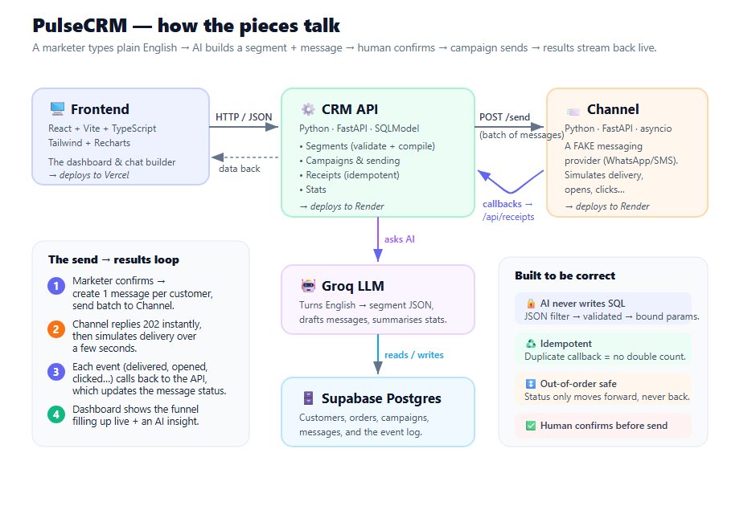

# PulseCRM — an AI marketing assistant for online brands

> **In one sentence:** a marketer types what they want in plain English — *"win
> back customers who haven't ordered in 30 days, give them 15% off"* — and
> PulseCRM figures out **who** to message, **writes** the message, sends it, and
> shows **how it performed** — all from a chat box.

It's like having a smart assistant for marketing campaigns. You describe the
goal; the AI does the fiddly parts (finding the right customers, drafting the
copy); **you stay in control and click "Launch" before anything is sent.**

---

## 🎬 What it actually does (a 30-second story)

1. You open the **Campaign Builder** and type:
   *"customers in Mumbai who spent over ₹5000."*
2. The AI instantly shows: **"312 customers match"** with a sample list — so you
   can sanity-check the audience before committing.
3. It also **drafts a ready-to-send message** like
   *"Hi {name}, here's 15% off just for you 🛍️"* — which you can edit.
4. You pick a channel (WhatsApp / SMS / Email), hit **🚀 Launch**, and the
   campaign sends.
5. The **campaign page fills up live** — delivered → opened → clicked →
   converted — with a one-line AI summary like *"Strong 28% click rate; next,
   improve the landing page to lift conversions."*

No spreadsheets, no SQL, no guesswork.

---

## 🧩 How it's built (the big picture)

PulseCRM is made of **three separate programs** that talk to each other over the
internet (HTTP). Splitting them up keeps each one simple and lets them scale and
deploy independently.



If the image doesn't render, here's the same idea in text:

```
   You (browser)
        │
        ▼
 ┌──────────────┐     "find these customers,      ┌──────────────┐
 │   Frontend   │      send this message"          │   CRM API    │
 │  (the UI you │ ───────────────────────────────▶ │ (the brain)  │
 │   click on)  │ ◀─────────────────────────────── │              │
 └──────────────┘     audience counts, stats        └──────┬───────┘
                                                     asks AI │ │ reads/writes
                                                            ▼ │ ▼
                                           ┌─────────┐   ┌──────────────┐
                                           │  Groq   │   │  Supabase    │
                                           │  (LLM)  │   │  (database)  │
                                           └─────────┘   └──────────────┘
                                                            ▲
                            "deliver these messages"        │ delivery updates
                                       │                    │ (callbacks)
                                       ▼                    │
                                 ┌──────────────────────────┴───┐
                                 │   Channel service             │
                                 │  (a fake WhatsApp/SMS gateway)│
                                 └───────────────────────────────┘
```

### The three programs

| Program | What it is, in plain words | Tech | Lives on |
|---|---|---|---|
| **Frontend** | The website you click on — dashboard, chat, charts. | React, Vite, TypeScript, Tailwind, Recharts | Vercel |
| **CRM API** | The "brain." Decides who matches, talks to the AI, saves everything, kicks off sends. | Python, FastAPI, SQLModel | Render |
| **Channel** | A **pretend** messaging provider. It stands in for WhatsApp/SMS so we don't need a real (paid) account, but it behaves like one. | Python, FastAPI, asyncio | Render |

Plus two services we use but don't run ourselves:

- **Groq** — the AI model that turns English into structured data and writes copy.
- **Supabase** — a hosted Postgres database where all the data lives.

> **Why is the Channel a whole separate service?** Because real messaging
> providers *are* separate services you call over the network — they take a
> while, can fail, and report back later. Modelling that honestly (instead of a
> simple function call) is the most interesting engineering in this project.

---

## 🔁 The most important flow: send → results

This is the heart of the system. When you click **Launch**:

**Step 1 — The CRM API prepares and sends** (`POST /api/campaigns/{id}/send`)
- Works out the full list of customers in your segment.
- Creates one "message record" per customer (status: `QUEUED`) and fills in their
  name.
- Hands the whole batch to the **Channel** service, along with a *callback
  address* ("call me back here when you have updates") and a shared secret.
- The Channel says **"got it" (202)** immediately — the CRM does **not** wait
  around for delivery. The campaign is marked `SENT` and you get control back.

**Step 2 — The Channel pretends to deliver** (in the background)
- For each message it rolls the dice: ~95% get **delivered**, then some are
  **opened**, fewer **read**, fewer **clicked**, a few **convert**; ~5% **fail**.
- Each step happens after a short random delay (like real life), and each is sent
  back to the CRM as a separate **callback**.
- It deliberately does two annoying-but-realistic things: sends some updates
  **out of order**, and **retries** if the CRM is briefly slow.

**Step 3 — The CRM records updates safely** (`POST /api/receipts`)
- Checks the secret matches.
- **Never double-counts:** every update has a unique ID; if the same one arrives
  twice (because of a retry), the second is ignored.
- **Never goes backwards:** if a late "opened" arrives *after* "clicked," the
  status stays at "clicked." Updates only ever move *forward* through the funnel.

**Step 4 — You watch it happen**
- The campaign page polls for stats and the funnel chart fills in live, topped
  with a plain-English AI insight.

✅ **All of this was tested end-to-end against the real database**, including the
tricky cases:
- *77 updates received → 77 counted (no duplicates), even with retries.*
- *Scrambled, out-of-order updates → status never moved backward.*

---

## 🛡️ The clever bit: AI that can't break your database

A natural worry: *"if an AI is choosing customers, can it run something
dangerous?"* PulseCRM is designed so the answer is **no, by construction.**

The AI **never writes SQL**. It only outputs a tiny, fixed-shape JSON "recipe":

```json
{ "all": [
    { "field": "last_order_at", "op": "before", "value": "30d_ago" },
    { "field": "total_spend",   "op": "gte",    "value": 5000 }
] }
```

That recipe goes through three gates before touching the database:

1. **Schema** (`segment_schema.py`) — the official list of allowed fields and
   operators. The AI's instructions are *generated from this list*, so they can
   never disagree.
2. **Validator** (`segment_validator.py`) — a strict bouncer. Anything not on the
   allowed list is rejected with a friendly message. *This is what makes the AI's
   output safe to run.*
3. **Compiler** (`segment_compiler.py`) — turns the approved recipe into a real
   database query where **every value is a safely-bound parameter**. SQL injection
   is impossible even though an AI produced the input.

Numbers like *total spend* and *last order date* are **calculated live** from the
orders table, so they're always accurate and never go stale.

---

## 🗃️ What's stored (the data model)

| Table | In plain words |
|---|---|
| **Customer** | A shopper: name, email, city, tags. (Spend & recency are computed, not stored.) |
| **Order** | A purchase: amount, items, date. |
| **Campaign** | A marketing blast: its goal, audience recipe, message, status. |
| **Communication** | One message to one customer, with its current status. |
| **CommunicationEvent** | A log of every delivery update received (each has a unique ID — this is what prevents double-counting). |

---

## ▶️ Run it on your machine

### You'll need
- **Python 3.11+**, **Node 18+**
- A **Supabase** database URL and a **Groq** API key (both free to create)

Open **three terminals**, one per service:

**Terminal 1 — the CRM API (the brain)**
```bash
cd crm-backend/api
python -m venv .venv
.venv\Scripts\activate            # Windows
# source .venv/bin/activate       # macOS / Linux
pip install -r requirements.txt
copy .env.example .env            # then fill in DATABASE_URL, GROQ_API_KEY, ...
python -m app.seed                # creates ~500 demo customers + ~2000 orders
uvicorn main:app --reload --port 8000
```

**Terminal 2 — the Channel (fake messaging provider)**
```bash
cd crm-backend/channel
python -m venv .venv
.venv\Scripts\activate
pip install -r requirements.txt
copy .env.example .env            # set CALLBACK_SECRET to the SAME value as the API's
uvicorn main:app --reload --port 8001
```

**Terminal 3 — the Frontend (the UI)**
```bash
cd crm-frontend
npm install
copy .env.example .env            # VITE_API_URL=http://localhost:8000
npm run dev                       # opens http://localhost:5173
```

Then visit **http://localhost:5173**, go to **Campaign Builder**, type something
like *"win back customers who haven't ordered in 30 days"*, and launch it. Watch
the campaign page fill in live.

---

## ☁️ Deploying it

| Piece | Where | How |
|---|---|---|
| **Frontend** | Vercel | Build `npm run build`, output `dist/`. Set `VITE_API_URL` to the API's URL. |
| **CRM API** | Render | Root `crm-backend/api`, start `uvicorn main:app --host 0.0.0.0 --port $PORT`. |
| **Channel** | Render | Root `crm-backend/channel`, same start command on its own URL. |

`crm-backend/render.yaml` describes both backend services so Render can set them
up from one repo. After deploying, point the API's `CHANNEL_SERVICE_URL` and
`CRM_BASE_URL` at the live URLs, and make sure `CALLBACK_SECRET` matches on both.

---

## 🚧 What I deliberately *didn't* build (and why)

Being clear about scope is part of good engineering:

- **A real messaging integration.** The brief says not to, and the *interesting*
  parts (async delivery, retries, no-double-counting, out-of-order handling) are
  all there in the simulator anyway.
- **A heavy-duty job queue.** The Channel sends callbacks using lightweight
  in-process async tasks with a concurrency cap. At real scale you'd swap this for
  a proper queue (SQS / Redis / QStash) and worker pool — explained in
  [`crm-backend/channel/README.md`](crm-backend/channel/README.md). The CRM side
  is already built to handle that reality.
- **Login / multiple accounts.** Not needed for a single-marketer demo.
- **Sales-CRM features** (deals, pipelines, support tickets). Explicitly out of
  scope — this is a tool for *reaching shoppers*, not managing a sales team.
- **Complex nested filters.** One level of AND/OR covers real marketing segments
  and keeps the safety checks simple to audit.

---

## 🗂️ Where things live

```
crm-frontend/                        the UI  → Vercel
  src/pages/        Dashboard, Chat (builder), Campaigns, CampaignDetail, Customers
  src/components/   reusable UI bits (Sidebar, Card, StatTile, charts…)
  src/api/          typed wrappers that call the backend
  src/lib/          shared types & formatting helpers

crm-backend/                         → Render (two services, one repo)
  api/        the brain
    app/routers/    HTTP endpoints (thin — just receive & respond)
    app/services/   the actual logic
    app/lib/        the segment pipeline + the status rules
    app/models.py   the database tables
    app/seed.py     demo-data generator
  channel/    the fake messaging provider
    app/simulator.py   decides each message's fate (delivered/opened/…)
    app/callbacks.py   sends updates back, with retries + concurrency limit
  render.yaml        deployment config for both
```

Each folder has its own README with more detail:
[`crm-backend/api`](crm-backend/api/README.md) ·
[`crm-backend/channel`](crm-backend/channel/README.md) ·
[`crm-frontend`](crm-frontend/README.md)
